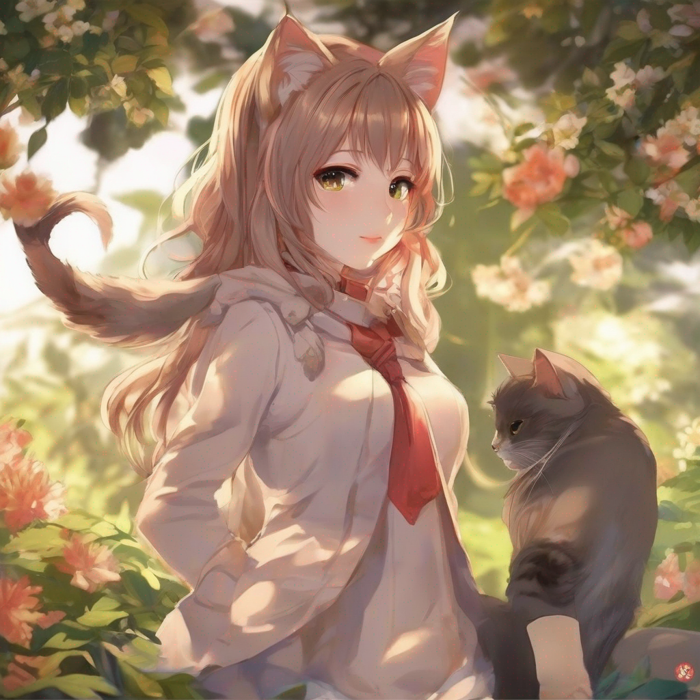
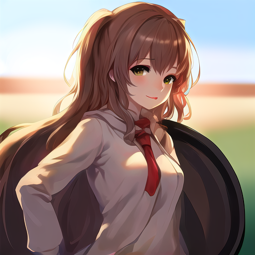
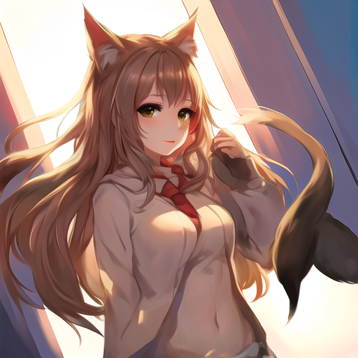

## About
I have conducted an experimental implementation of DreamTuner (https://arxiv.org/abs/2312.13691). **This is an unofficial implementation**, and while it is unclear if the implementation is correct, some positive effects have been observed.

The implementation involves a two-step training process:

1. Subject Encoder Training
2. Subject Driven Fine-tuning

In the Subject Encoder Training, a Subject Encoder is used for feature extraction of reference images. A Self-Encoder-Attention layer is added between the Self-Attention and Cross-Attention layers of the Unet's Transformer Block, and training is conducted (see train.py). Inference using only the Subject Encoder can be performed using inference.py.

Subject Driven Fine-tuning essentially involves fine-tuning through Dreambooth + Textual Inversion. Prior to this implementation, the effects of Self-Subject Attention and the implementation of a Unet and Reference Guidance (as a replacement for CFG) for reference images need to be evaluated. Self-Subject Driven inference can be performed using inference_ss.py.

If the generated results are satisfactory, Subject Driven Fine-tuning is carried out (see train_dreambooth.py). The resulting Subject Encoder, Unet, and Text Inversion models can be used for inference with inference_ss.py.

Currently, there is no support for Subject Driven Inference using ControlNet.

Note:
Some aspects of the implementation diverge from the details in the paper. Particularly, the Subject Encoder showed no significant difference, so it has been replaced with the SSR-Encoder implementation (https://arxiv.org/abs/2312.16272).

Training was conducted on an anime model with about 50,000 images. As described in the paper, some effects were anticipated, but due to the quality and quantity of the dataset and GPU limitations leading to a higher learning rate, the results were not as responsive to prompts as expected.
If you are experimenting, it's necessary to properly adjust values such as the Subject Encoder beta and the Reference Guidance Scale.

Considering the GPU processing time and the dataset's quality and quantity, further training by an individual is deemed challenging. While I do not intend to continue development, the implementation is made public.

The trained Subject Encoder can be downloaded from here. Replace the Pretrained models under models/dreamtuner with it for use.


## Environment

*Python* 3.10.9
*CUDA* 12.2

## Installation

```
python -m venv venv
source venv/bin/activate
```

```
pip install -r requirements.txt
```


### Downloading the Base Model

```
mkdir datasets
mkdir models

cd ./models
git clone some_diffusers_sd_15_model_from_huggin_face
# ex) git clone https://huggingface.co/runwayml/stable-diffusion-v1-5 or some_anime_model

# copy base model for finetuning
cp -r some_diffusers_sd_15_model_from_huggin_face/ dreamtuner
```

### Preparing the Dataset

```
# your datasets into ./datasets 
```

Creating images for background removal, masks, and depth
```
python process.py path
```

Creating tags
```
python process_tags.py path
```


## Training

with accelerater
```
# configulation
accelerate config

# training 
bash ./train.sh
```

When training is complete, copy the generated files (subject_encoder, unet) to 'models/dreamtuner' folder.

You will need to modify model_index.json as follows to replace the subject encoder and unet modules when loading.
Also, please modify it if you have a different scheduler, as it will not work with anything other than the DDIM scheduler.

```
{
    "_class_name": "DreamTunerPipelineSelfSubject",
    "_diffusers_version": "0.8.0.dev0",
    "feature_extractor": [
      "transformers",
      "CLIPImageProcessor"
    ],
    "safety_checker": [
      "stable_diffusion",
      "StableDiffusionSafetyChecker"
    ],
    "scheduler": [
      "diffusers",
      "DDIMScheduler"
    ],
    "text_encoder": [
      "transformers",
      "CLIPTextModel"
    ],
    "tokenizer": [
      "transformers",
      "CLIPTokenizer"
    ],
    "subject_encoder": [
      "dreamtuner.models.subject_encoder",
      "SubjectEncoder"
    ],
    "unet": [
      "dreamtuner.models.unet",
      "SDUNet2DConditionModel"
    ],
    "vae": [
      "diffusers",
      "AutoencoderKL"
    ],
    "unet_reference": [
      "dreamtuner.models.unet",
      "SDUNet2DConditionModel"
    ]
}
```


### train dreambooth

```
bash ./train_dreambooth.sh
```

## Inference

### Subject Encoder inference

```
python inference.py --model_name_or_path ./models/dreamtuner --subject_encoder_beta 0.5 --num_samples 1 --num_inference_steps 50 --reference_image ./datasets/sample/00006_rgb.png --negative_prompt "worst quality, normal quality, low quality, low res, blurry, text, watermark, logo, banner, extra digits, cropped, jpeg artifacts, signature, username, error, sketch ,duplicate, ugly, monochrome, horror, geometry, mutation, disgusting" --prompt "best quality,1girl,outdoor"
```

### Subject Driven inference

witout mask, without reference guidance (self-subject attention only)

```
python inference_ss.py --model_name_or_path ./models/dreamtuner --subject_encoder_beta 0.2 --num_samples 1 --num_inference_steps 50 --reference_image ./datasets/sample/00006_rgb.png --negative_prompt "worst quality, normal quality, low quality, low res, blurry, text, watermark, logo, banner, extra digits, cropped, jpeg artifacts, signature, username, error, sketch ,duplicate, ugly, monochrome, horror, geometry, mutation, disgusting" --prompt "best quality,1girl,outdoor" --dtype float16
```

with mask, with reference guidance
```
python inference_ss.py --model_name_or_path ./models/dreamtuner --subject_encoder_beta 0.2 --num_samples 1 --num_inference_steps 50 --reference_image ./datasets/sample/00006_rgb.png --mask_image ./datasets/sample/00006_mask.png --negative_prompt "worst quality, normal quality, low quality, low res, blurry, text, watermark, logo, banner, extra digits, cropped, jpeg artifacts, signature, username, error, sketch ,duplicate, ugly, monochrome, horror, geometry, mutation, disgusting" --prompt "best quality,1girl,outdoor" --enable_reference_guidance --reference_guidance_scale 2  --dtype float16
```


with textual invertion
```
python inference_ss.py --model_name_or_path ./models/dreamtuner_tuned --text_embeds_name_or_path ./models/dreamtuner_tuned/textual_inversion --subject_encoder_beta 0.2 --num_samples 1 --num_inference_steps 50 --reference_image ./datasets/sample/00009_rgb.png --mask_image ./datasets/sample/00009_mask.png --negative_prompt "worst quality, normal quality, low quality, low res, blurry, text, watermark, logo, banner, extra digits, cropped, jpeg artifacts, signature, username, error, sketch ,duplicate, ugly, monochrome, horror, geometry, mutation, disgusting" --prompt "best quality,1girl,outdoor" --enable_reference_guidance --reference_guidance_scale 2  --dtype float16
```

### Sample 

#### Original
 

#### Generated Images
 